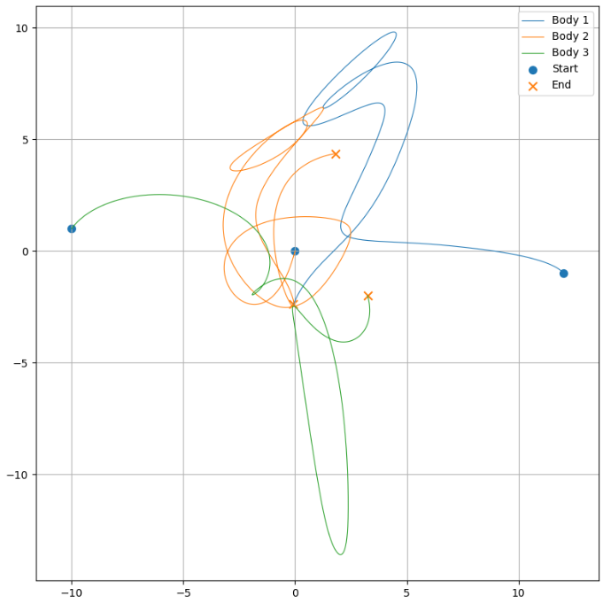

# Three-Body Problem — Numerical Exploration

Python three body system simulation, using velocity-Verlet with Newtons equations.



  • Python scripts with Jupyter simulating three body system using velocity-Verlet.
  • Matplotlib used to create GIFs and PNGs showing pathway of each body.
  • Absolute and fractional Energy error over time also calculated and graphed.
  • Further Scripts exploring usage of adaptive time-stepping to reduce Energy error in close encounters.
  
---

## Background

Masses attract each other through the force of gravity.
Newtons equation shows this force is proportional to the magnitude of the masses (m_1,m_2) and the inverse square of their absolute distance (r):
    $F = G \frac{m_1 m_2}{r^2}$
Therefore (using F = ma) we can form the equation for the effects of gravity on one body to another at one instance as:
 $$ \frac{G \cdot m_2}{r^2} = a = \frac{dv}{dt} $$

Given initial starting positions and velocities for each mass in a system -  we can use this equation (in its vectorised form) to approximate the paths of each mass over time by summing up forces between pairs at each instant and stepping velocities and positions forward.

Some systems remain stable (the bodies in the system trace repetitive paths through space relative to each over many orbits), whereas many orbit chaotically and non periodically or eject one or more bodies away from the system.

Calculating if a two body system is stable is typically trivial, however adding just one more body results in the need for far more computations in most cases. Three body systems exhibit chaotic motion, even very slight changes in starting conditions can completely change the pathway of each mass over time.

---

## Numerics

The velocity-Verlet integrator is used to step the system forward for this simulation.
It is a suitable integrator for this usage as it is *symplectic*.
A symplectic integrator preserves phase space volume as it evolves.
The benefit of this for the three body system is it keeps the energy error of the system bounded in most cases.
Without this the energy error can continually increase as the system is stepped forward, causing bodies to spiral away even in a stable system.

Some of the scripts in the project use adaptive time stepping, reducing the time jump when two bodies are close to each other.
This is intended to further reduce the energy errors which can occur in close encounters.
This does however break the sympleticity of the intergrator.
## Future Work

The planned next stages of the project are:

1. Quantitatively compare Euler, RK4 and Velocity Verlet integration.
2. Investigate timestep convergence and numerical error.
3. Improve the treatment of close encounters.
4. Investigate alternative approaches to numerical regularisation.
5. Develop automated stability criteria.
6. Develop a systematic search across the relevant initial-condition parameter space.
7. Develop methods for identifying periodic orbits.
8. Benchmark computational performance and investigate optimisation.
9. Automatically visualise and analyse candidate systems.
10. Compare candidate solutions against known solutions in the literature.
11. Investigate whether the search can identify previously undocumented stable or periodic configurations.

---

## Repo contents

The notebooks are numbered in reading order — each builds on the previous.

1. `01_basic_verlet.ipynb` — minimal velocity-Verlet integrator for three bodies, no visualisation.
2. `02_verlet_animated.ipynb` — same integrator with a matplotlib animation of the trajectories.
3. `03_energy_diagnostics.ipynb` — adds total-energy tracking and plots relative energy error over time.
4. `04_efficient_animation.ipynb` — trail-based static plots for visualising long integrations without the animation cost.
5. `05_adaptive_timestep.ipynb` — adaptive timestep scheme to handle close encounters without energy blow-up.

---

## How to run it

Requires Python 3.10+.

```bash
git clone https://github.com/zackraven/3Bodies.git
cd 3Bodies
pip install -r requirements.txt
jupyter lab
```

Open any notebook and run all cells.

---

## Validation

Before treating the integrator as reliable, I tested it against two known configurations:

- **Sun–Planet–Moon system** — a hierarchical three-body system where one mass dominates. The planet and moon should trace stable, near-Keplerian orbits over many periods. Confirmed stable over [N] orbits with relative energy error below [X].
- **Chenciner–Montgomery figure-8 orbit** — three equal masses following the same figure-eight curve with zero angular momentum. A non-trivial periodic solution to the equal-mass three-body problem, useful as a benchmark because any drift in the integrator shows up quickly as a broken figure-8. Reproduced successfully with the initial conditions from Chenciner & Montgomery (2000).


## Technologies

* **Python**
* **NumPy**
* **Matplotlib**
* **Jupyter**
* **FFmpeg**

---

## Project Status

**Started:** 20/07/2026

**Current stage:** Numerical-method development and validation

**Next stage:** Automated search for stable and periodic configurations
